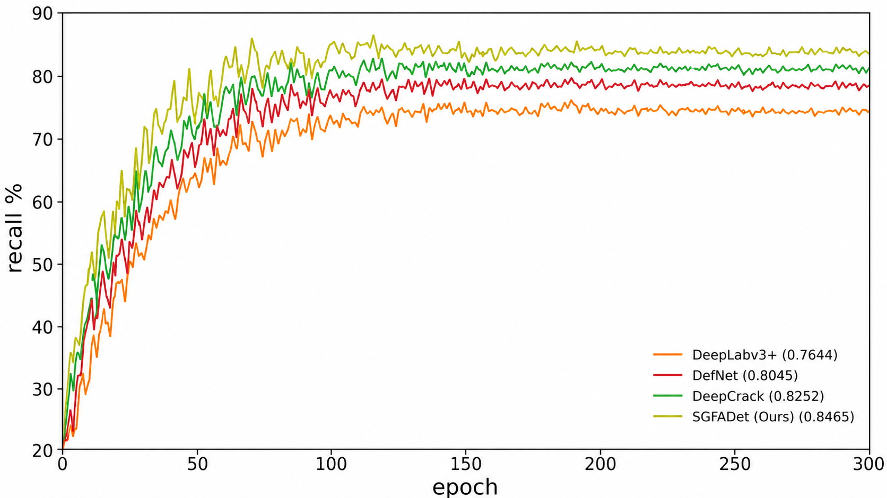
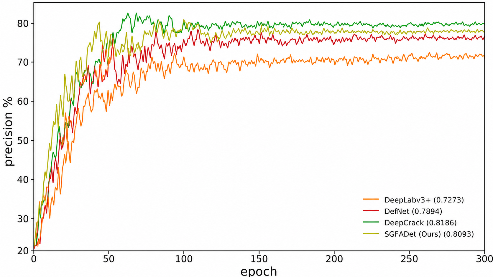
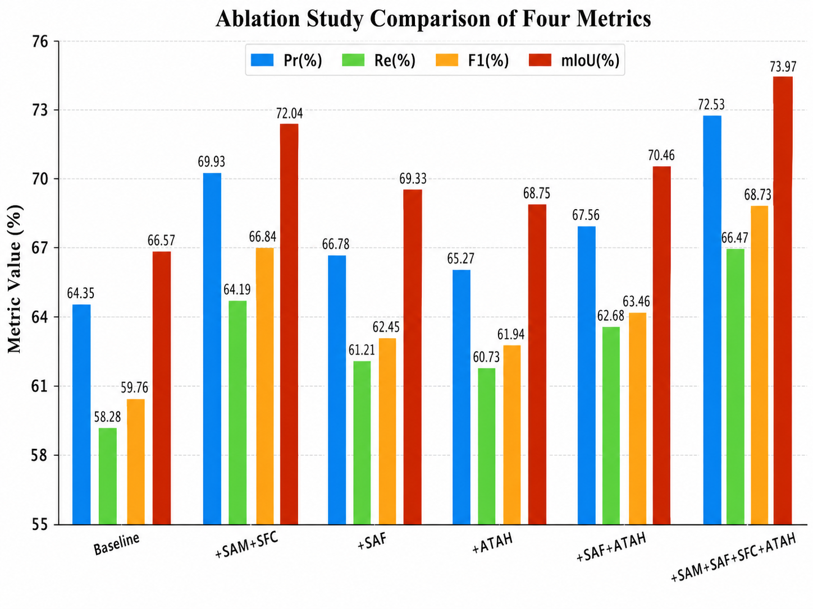
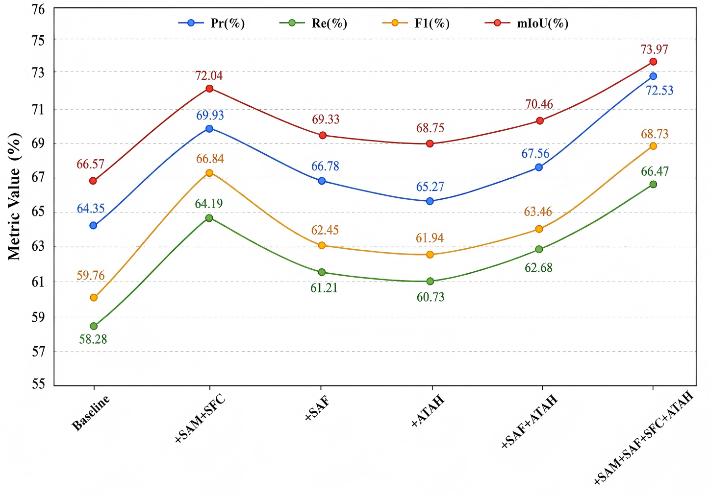
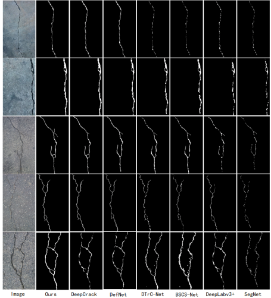
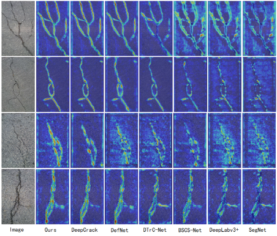

# SGFADet: SAM-Guided Feature Adaptive Learning for UAV-Based Road Crack Segmentation

本仓库是 **SGFADet** 的源码工程，用于无人机道路裂缝二值语义分割。代码以用户提供的 YOLO/Ultralytics 语义分割训练框架为底座，按照论文网络结构重组为 SGFADet 工程：

> RGB 细节增强 → SAM 先验引导 → 多尺度自适应融合 → 任务感知预测对齐

核心模块包括：

- **SAM Prior Branch**：冻结 SAM image encoder，输出 P3/P4/P5 多尺度语义先验；未提供 SAM 权重时使用冻结 RGB+Sobel prior 作为可运行 fallback。
- **SFC, Salient Feature Calibrator**：嵌入 RGB 主干，对裂缝显著结构、边界和局部纹理进行双分支、双门控、残差校准。
- **SAF, SAM-guided Adaptive Fusion**：在 P3/P4/P5 关键尺度上自适应融合 RGB 特征与 SAM 先验。
- **Neck**：通过 Upsample、Concat、C3k2 完成多尺度层级聚合。
- **ATAH, Adaptive Task-Aware Alignment Head**：通过语义分支与几何分支对齐，输出裂缝分割 logits。

---

## 1. 源码目录

```text
SGFADet/
├── README.md
├── LICENSE
├── pyproject.toml
├── SGFADet_Network/
│   ├── SGFADet_Model.py
│   ├── Backbone/
│   │   ├── SAM_Prior_Branch.py
│   │   └── RGB_Backbone_with_SFC.py
│   ├── Modules/
│   │   └── SFC_Salient_Feature_Calibrator.py
│   ├── Fusion/
│   │   └── SAF_SAM_Guided_Adaptive_Fusion.py
│   ├── Neck/
│   │   └── MultiScale_Feature_Aggregation_Neck.py
│   └── Head/
│       └── ATAH_Adaptive_Task_Aware_Alignment_Head.py
├── SGFADet_Configs/
│   ├── Network/
│   │   └── SGFADetn_Semantic.yaml
│   └── Datasets/
│       ├── Generic_Crack_Semantic.yaml
│       ├── CUAV_Crack500.yaml
│       ├── CrackTree260.yaml
│       └── CrackLS315.yaml
├── SGFADet_Experiments/
│   ├── Train/train_SGFADet.py
│   ├── Validation/validate_SGFADet.py
│   ├── Test/test_SGFADet.py
│   ├── Inference/predict_SGFADet.py
│   ├── Evaluation/evaluate_SGFADet_masks.py
│   └── QuickCheck/quick_check_SGFADet.py
└── ultralytics/
    └── 已集成 SGFADet 语义分割训练、验证、预测和指标计算的底层引擎
```

说明：`SGFADet_Network` 和 `SGFADet_Configs` 是论文结构对应的显式源码层；`ultralytics/` 是为了复用训练器、验证器、数据加载、loss、日志与导出能力而保留的底层工程代码。

---

## 2. 网络结构对应关系

| 论文结构 | 源码位置 | 作用 |
|---|---|---|
| Backbone / SAM Prior Branch | `SGFADet_Network/Backbone/SAM_Prior_Branch.py`，底层实现为 `ultralytics/nn/modules/sgfadet.py::SAMFrozenPyramid` | 冻结 SAM 先验分支，输出 P3/P4/P5 prior |
| Backbone / RGB Branch + SFC | `SGFADet_Network/Backbone/RGB_Backbone_with_SFC.py`，`SGFADet_Network/Modules/SFC_Salient_Feature_Calibrator.py` | RGB 主干与显著特征校准 |
| SAF | `SGFADet_Network/Fusion/SAF_SAM_Guided_Adaptive_Fusion.py` | RGB 与 SAM 先验自适应融合 |
| Neck | `SGFADet_Network/Neck/MultiScale_Feature_Aggregation_Neck.py`，结构定义在 `SGFADet_Configs/Network/SGFADetn_Semantic.yaml` | 多尺度特征聚合 |
| ATAH | `SGFADet_Network/Head/ATAH_Adaptive_Task_Aware_Alignment_Head.py` | 预测端语义/几何任务感知对齐 |
| SGFADet 完整结构 | `SGFADet_Configs/Network/SGFADetn_Semantic.yaml` | Conv-C3k2-SPPF-C2PSA + SFC + SAF + Neck + ATAH |

底层可执行模块集中在：

```text
ultralytics/nn/modules/sgfadet.py
```

该文件实现 `SAMFrozenPyramid`、`SFC`、`SAF`、`ATAH`、`ATAHSegment`，并已在 `ultralytics/nn/modules/__init__.py` 与 `ultralytics/nn/tasks.py` 中注册。

---

## 3. 环境安装

建议使用 Python 3.10 或更高版本，并安装 PyTorch。进入源码根目录后执行：

```bash
pip install -e .
```

可选安装真实 SAM 分支依赖：

```bash
pip install segment-anything
```

真实 SAM checkpoint 不随源码分发。训练或验证时通过 `--sam-checkpoint` 指定，例如：

```bash
--sam-checkpoint /path/to/sam_vit_b_01ec64.pth
```

未指定 SAM checkpoint 时，代码会自动使用冻结 RGB+Sobel prior，便于先验证代码流程。

---

## 4. 数据集格式

推荐使用语义分割 PNG mask 格式：

```text
dataset_root/
├── images/
│   ├── train/*.jpg|png
│   ├── val/*.jpg|png
│   └── test/*.jpg|png
└── masks/
    ├── train/*.png
    ├── val/*.png
    └── test/*.png
```

每张图像对应一个同名 mask，例如：

```text
images/train/0001.jpg  ->  masks/train/0001.png
```

二值裂缝 mask 约定：

```text
0   = background
1   = crack
255 = ignore，可选
```

如果你的标注是 `0/255`，可直接用于独立评估脚本；训练时建议转换为 `0/1` 或确认数据加载逻辑按二值前景处理。

按实际路径修改以下配置：

```text
SGFADet_Configs/Datasets/Generic_Crack_Semantic.yaml
SGFADet_Configs/Datasets/CUAV_Crack500.yaml
SGFADet_Configs/Datasets/CrackTree260.yaml
SGFADet_Configs/Datasets/CrackLS315.yaml
```

---

## 5. 快速前向检查

无需数据集，构建 SGFADet 并进行一次随机前向：

```bash
python SGFADet_Experiments/QuickCheck/quick_check_SGFADet.py \
  --device cpu \
  --imgsz 256 \
  --sam-backend edge
```

预期输出类似：

```text
Output shape: (1, 1, 32, 32)
```

---

## 6. 训练

论文默认实验设置已写入训练脚本：`imgsz=640`、`epochs=100`、`batch=4`、`optimizer=Adam`、`lr0=5e-4`、`weight_decay=3e-5`，并启用旋转、水平翻转和垂直翻转增强。

```bash
python SGFADet_Experiments/Train/train_SGFADet.py \
  --data SGFADet_Configs/Datasets/CUAV_Crack500.yaml \
  --model SGFADet_Configs/Network/SGFADetn_Semantic.yaml \
  --sam-checkpoint /path/to/sam_vit_b_01ec64.pth \
  --device 0 \
  --project runs/SGFADet \
  --name CUAV_Crack500_SGFADet
```

强制使用真实 SAM：

```bash
--sam-backend sam
```

强制使用轻量 fallback：

```bash
--sam-backend edge
```

---

## 7. 验证与测试

验证集：

```bash
python SGFADet_Experiments/Validation/validate_SGFADet.py \
  --weights runs/SGFADet/CUAV_Crack500_SGFADet/weights/best.pt \
  --data SGFADet_Configs/Datasets/CUAV_Crack500.yaml \
  --device 0 \
  --save-masks
```

测试集：

```bash
python SGFADet_Experiments/Test/test_SGFADet.py \
  --weights runs/SGFADet/CUAV_Crack500_SGFADet/weights/best.pt \
  --data SGFADet_Configs/Datasets/CUAV_Crack500.yaml \
  --device 0 \
  --save-masks
```

日志输出指标：

```text
Precision, Recall, F1, mIoU, PixAcc
```

其中 `Precision`、`Recall`、`F1` 默认针对 crack foreground；二值 `mIoU` 采用 `mean(IoU_background, IoU_crack)`。

---

## 8. 独立 mask 指标评估

如果已保存预测 PNG，可直接计算论文四项指标：

```bash
python SGFADet_Experiments/Evaluation/evaluate_SGFADet_masks.py \
  --pred-dir runs/SGFADet/test/masks \
  --gt-dir /path/to/CUAV-Crack500/masks/test \
  --save-json runs/SGFADet/test/metrics.json \
  --save-csv runs/SGFADet/test/per_image_metrics.csv
```

---

## 9. 预测

```bash
python SGFADet_Experiments/Inference/predict_SGFADet.py \
  --weights runs/SGFADet/CUAV_Crack500_SGFADet/weights/best.pt \
  --source /path/to/images_or_video \
  --device 0 \
  --save-overlay
```

原始类别 mask 默认保存到：

```text
runs/SGFADet/predict/masks/
```

---

## 10. 复现实验数据集

论文实验涉及以下数据集模板：

- `CUAV_Crack500.yaml`
- `CrackTree260.yaml`
- `CrackLS315.yaml`

请将 YAML 中的 `path`、`train`、`val`、`test` 修改为你的实际数据集路径后再运行。

---

## 11. 实验图片说明

`images/` 目录中存放了论文实验部分对应的 6 张可视化图片，主要用于展示 SGFADet 的训练收敛趋势、模块消融效果以及裂缝分割可视化表现。各图片可直接在 README 中查看，也可作为论文实验结果复现后的对照材料。

### 11.1 Recall 训练曲线

该图比较 DeepLabv3+、DefNet、DeepCrack 与 SGFADet 在 CrackTree260 数据集上的 Recall 随训练 epoch 变化的趋势。SGFADet 在训练早期快速提升，并在后期稳定收敛到较高水平；最终 Recall 为 0.8465，高于对比方法，说明该模型对裂缝前景像素具有更强的捕获能力，有助于降低细小裂缝与弱对比裂缝的漏检。



### 11.2 Precision 训练曲线

该图展示 DeepLabv3+、DefNet、DeepCrack 与 SGFADet 在 CrackTree260 数据集上的 Precision 训练变化。SGFADet 在收敛阶段保持较高且相对稳定的精确率，最终 Precision 为 0.8093；结合 Recall 曲线可见，SGFADet 在裂缝像素召回与背景误检抑制之间取得了更均衡的表现。



### 11.3 消融实验柱状对比图

该图以柱状图形式展示 Baseline、`+SAM+SFC`、`+SAF`、`+ATAH`、`+SAF+ATAH` 以及完整 SGFADet 在 Precision、Recall、F1 和 mIoU 四项指标上的对比。完整模型 `+SAM+SAF+SFC+ATAH` 在四项指标上均取得最高结果，分别达到 72.53%、66.47%、68.73% 和 73.97%，说明 SAM 先验、SFC 显著特征校准、SAF 自适应融合和 ATAH 任务感知对齐具有互补作用。



### 11.4 消融实验指标变化趋势图

该图以折线形式进一步展示不同模块组合下四项指标的变化趋势。相较于 Baseline，完整 SGFADet 的 Precision 从 64.35% 提升至 72.53%，Recall 从 58.28% 提升至 66.47%，F1 从 59.76% 提升至 68.73%，mIoU 从 66.57% 提升至 73.97%。趋势图更直观地表明，多模块协同能够稳定提升裂缝识别、区域重叠质量和整体分割性能。



### 11.5 裂缝分割结果可视化对比

该图给出了原始道路裂缝图像及不同方法的二值分割结果，包括 SGFADet、DeepCrack、DefNet、DTrC-Net、BSCS-Net、DeepLabv3+ 和 SegNet。SGFADet 能够更完整地保留裂缝主干、细小分支和弯曲结构，在细长裂缝、多分支裂缝以及弱对比场景中表现出更好的连续性和边界一致性；其他方法更容易出现局部断裂、细节丢失或背景误检。



### 11.6 裂缝区域特征响应热力图对比

该图展示不同方法在裂缝区域上的特征响应热力图。SGFADet 的高响应区域更加集中于真实裂缝位置，背景区域响应较弱，说明其能够有效聚焦裂缝相关结构并抑制路面纹理、阴影和噪声干扰。与二值分割结果结合来看，该热力图进一步验证了 SGFADet 在裂缝连续性、细节保持和复杂背景抑制方面的稳定性。



---

## 12. 许可证与来源说明

本工程基于用户上传的 YOLO/Ultralytics 源码改造，保留其 AGPL-3.0 许可文件，并新增 SGFADet 网络模块、配置、训练、验证、测试、预测和评估代码。使用、修改或发布时请同时遵守原始工程和本工程中的许可证要求。
